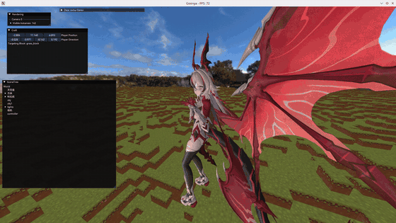
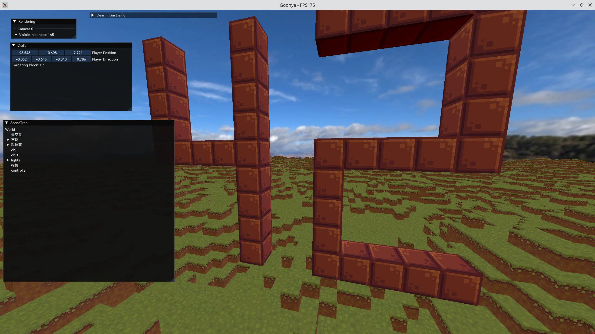

# Goonya

Goonya是一个出于个人学习目的开发的游戏引擎

## 预览





# 构建与运行

依赖：xmake、支持 C++23 的编译器。

```bash
xmake build GDemo   # 引擎 GRuntime 编译为静态库，游戏 GDemo 链接运行
xmake run GDemo     # 运行，工作目录为 bin/
```

## 资产说明

部分演示资产因版权与配布条款不包含在仓库内：
- 骨骼动画演示所用的角色模型「科拉莉」来自[模之屋](https://www.aplaybox.com/details/model/NNq9OP5jY9l5)，动作来自[アイドル（Idol/偶像）-YOASOBI](https://www.bilibili.com/video/BV1Vm4y1y7Sc/?share_source=copy_web&vd_source=1aeea1170a708a5b5cc29086f4355482)（作者条款禁止二次配布）。
- Craft 的方块纹理解析自 Minecraft 客户端资源包，需自行从.jar中解包正版游戏(版本1.12.11)资产放入 `assets/minecraft/`。

# 理念

Goonya的设计非常“传统”。经典的对象-组件化结构，单线程的游戏循环+多线程处理异步任务。传统的剔除-排序-合批的前向渲染管线，以及参考冯乐乐《Unity Shader 入门精要》的辉光实现（是的，有后处理！）。
使用不够新又不够老的OpenGL 4.5（没有用到4.6的着色器字节码支持），这是所有图形API中使用最便捷的版本。

整个引擎编译成运行时静态库，游戏独立编译并链接，启动引擎并加载初始场景，进入主循环。

# 资源

支持从外部加载包括场景和着色器和材质在内的资源。所有资源使用.meta文件记录元数据，资源加载器自动搜索加载不同类型的资源并实现复用（比如多物体共用一个材质）。但引擎没有引入脚本支持，游戏逻辑必须使用C++编写组件的方式实现。

实现了对glTF2.0的部分兼容，可以从glTF加载网格、场景节点树和材质参数（含纹理）。glTF加载材质时固定使用一个不是完全符合glTF标准的元着色器（基本上是Cook-Torrance BRDF）生成材质实例，支持ORM贴图及对应系数，环境光照采用运行时GGX重要性采样（硬积分，而非split sum，压力给到显卡）。

# 材质和着色器

着色器文件.gshader被加载为元着色器UberShader，其中实现了基于文本处理的着色器预处理器，支持按需编译，着色器变体，include，顶点和像素着色器写入一个文件，重复的定义只写一次。
支持着色器定义默认材质参数值和纹理（没错这也是借鉴的Unity），材质资源可以覆盖定义，运行时可以动态修改。
从一个UberShader可以创建任意多材质实例，每个材质实例具有独立变体，参数和纹理，材质实例可在对象间复用。
预处理器基于材质参数定义在编译时动态生成材质参数的uniform buffer结构，通过着色器反射获取内部偏移。渲染时只对发生修改的材质参数buffer进行更新。同变体的着色器只编译一次。
计算着色器支持除了材质系统外的所有功能，用起来也挺方便

# 动画和蒙皮
支持从glTF中加载动画（节点变换的关键帧时间序列）和蒙皮（Skinning）数据，播放骨骼动画。蒙皮提供CPU计算和GPU计算着色器（Compute Shader）两条路径，均通过动态更新网格数据完成蒙皮，顶点着色器零修改，同时处理顶点位置、法线和切线。顶点布局上将受蒙皮影响的数据（位置/法线/切线）与不变的数据（顶点色和UV）分离到不同的顶点缓冲，最大化静态数据复用，减少每帧更新上传的数据量。

# Craft
能放置和破坏方块的Minecraft。3个维度方向的无限世界生成，基于任务系统的异步的区块生成和网格化（相邻内部面剔除）。资产直接解析Minecraft的内置资源包，并且模仿了Minecraft的全局静态注册器，可以非常轻松地添加新的方块和方块状态。

# 致谢

- 天空盒：[Penguin Museum](https://polyhaven.com/a/penguin_museum)，来自 Poly Haven，以 [CC0](https://creativecommons.org/publicdomain/zero/1.0/) 协议发布
